# Production-Grade RAG Assistant

[](https://fastapi.tiangolo.com)
[](https://react.dev)
[](https://trychroma.com)
[](https://docker.com)
[](LICENSE)

A production-grade, local-first **Retrieval-Augmented Generation (RAG)** assistant designed to ingest, process, and search **10,000+ mixed-format documents** (PDFs, HTML, CSVs) completely locally, with high-fidelity streaming responses, strict security controls, and real-time observability.

---

##  The Problem & The Solution

In typical enterprise environments, deploying RAG systems poses three major challenges:
1. **Data Privacy & Leakage**: Uploading sensitive PDFs or spreadsheets to third-party APIs risks data exposure.
2. **Unpredictable Costs**: Querying vector databases and LLMs at scale leads to ballooning cloud bills.
3. **Hallucinations & Integrity**: LLMs can make up facts, and it's hard to trace their answers back to the actual source.

**This Assistant solves these issues by executing all document parsing, embeddings, search fusion, and reranking locally on your own machine.** The only external calls are to lightweight, secure LLMs (like Google Gemini) using a highly resilient fallback architecture.

---

##  System Architecture & Data Flow

Here is how documents are processed and queries are answered under the hood:

```mermaid
graph TD
    %% Ingestion Pipeline
    subgraph Ingestion ["1. Document Ingestion"]
        A[Raw Files: PDF, HTML, CSV] --> B[Structure-Aware Parsers]
        B --> C[Recursive & Semantic Chunkers]
        C --> D[Local Embedder: all-MiniLM-L6-v2]
        D --> E[(ChromaDB Vector Store)]
        D --> F[(BM25 Sparse Keyword Index)]
    end

    %% Retrieval Pipeline
    subgraph Retrieval ["2. Multi-Stage Retrieval"]
        G[User Query] --> H{Injection Guard}
        H -->|Pass| I[ChromaDB Dense Search]
        H -->|Pass| J[BM25 Okapi Sparse Search]
        I --> K[Reciprocal Rank Fusion - RRF]
        J --> K
        K --> L[Local Reranker: ms-marco-MiniLM-L-6-v2]
        L --> M[Embedding-Similarity Context Compression]
    end

    %% Generation Pipeline
    subgraph Generation ["3. Generation & Safety"]
        M --> N[Prompt Builder & Context Citations]
        N --> O[LLM Client: Gemini / OpenAI Fallback]
        O --> P[SSE Token Stream]
        P --> Q[Local Hallucination Evaluator]
        Q --> R[Dashboard UI with Citations Explorer]
    end

    style Ingestion fill:#1e1e2f,stroke:#6c63ff,stroke-width:2px;
    style Retrieval fill:#1e1e2f,stroke:#00b4d8,stroke-width:2px;
    style Generation fill:#1e1e2f,stroke:#4caf50,stroke-width:2px;
```



---

##  Core Features

### 1. Structure-Aware Hybrid Ingestion
*   **PDF Parser**: Page-by-page extraction with structural layouts preserved using PyMuPDF.
*   **HTML Parser**: Boilerplate, scripts, and navigation stripped out using BeautifulSoup4, preserving main content tags.
*   **CSV Table Indexer**: Sliding-window row indexing that retains column headers so structured cell relations aren't lost.
*   **Local Embedding Cache**: Employs an disk-based `diskcache` layer. Re-indexing the same files generates zero new compute or API costs.

### 2. Multi-Stage Hybrid Retrieval
*   **Hybrid Dense/Sparse Search**: Executes conceptual vector search (ChromaDB) and exact keyword search (BM25 Okapi) in parallel.
*   **Reciprocal Rank Fusion (RRF)**: Merges lists mathematically ($k=60$) to locate documents containing both exact keywords and matching conceptual topics.
*   **Local Cross-Encoder Reranking**: Passes the top 20 candidate chunks through a local `ms-marco-MiniLM-L-6-v2` reranker, narrowing down to the top 5 highly precise chunks.
*   **Context Compression**: Breaks chunks into individual sentences and discards any sentence with a similarity score below $0.5$ against the user query, keeping prompt payloads extremely compact.

### 3. Generation & Safety
*   **Resilient Fallback Chain**: Defaults to Google Gemini (`gemini-2.5-flash` or `gemini-2.0-flash` supporting the newer `AQ.` keys), automatically falling back to OpenAI (`gpt-4o-mini`) if rate limits or connection errors occur.
*   **SSE Response Streaming**: Streams answers token-by-token using Server-Sent Events, appending citation metadata (source, chunk text, page/row, and confidence score) at the end of the stream.
*   **SQL Session Memory**: Saves conversation state and stores message logs inside an asynchronous SQLite database (`aiosqlite`).
*   **Prompt Injection Defense**: Validates input queries against jailbreak pattern signatures, base64-encoded instructions, and roleplay bypasses.
*   **Hallucination Checker**: Computes a local cosine similarity score between the generated answer and the retrieved source text, flagging responses that deviate significantly.

---

## 🚀 Getting Started

Choose the path that fits your setup:

### Option 1: Unified Container (Docker Compose — Recommended) 🐳

Spin up the entire system (Frontend, Backend API, Prometheus metrics, and Grafana dashboards) in a single command.

1.  **Clone the repository** and navigate to the project root:
    ```bash
    cd rag/
    ```
2.  **Configure Environment Variables**:
    ```bash
    cp .env.example .env
    ```
    Open the `.env` file and add your Google Gemini API key:
    ```env
    GEMINI_API_KEY=your_key_here
    ```
3.  **Start all services**:
    ```bash
    docker-compose up -d
    ```

Access endpoints:
*    **Frontend Dashboard**: `http://localhost:3000`
*    **Backend API Docs**: `http://localhost:8000/docs`
*    **Grafana Telemetry**: `http://localhost:3001` (Default: `admin`/`admin123`)

---

### Option 2: Local Development Setup 

#### 1. Backend Server Setup
1. Navigate to the backend directory:
   ```bash
   cd backend/
   ```
2. Create and activate a Python virtual environment:
   * **Windows (PowerShell)**:
     ```powershell
     python -m venv venv
     .\venv\Scripts\Activate.ps1
     ```
   * **macOS/Linux**:
     ```bash
     python3 -m venv venv
     source venv/bin/activate
     ```
3. Install Python dependencies:
   ```bash
   pip install -r requirements.txt
   ```
4. Copy the environment variables:
   ```bash
   cp ../.env.example .env
   ```
5. Initialize local data storage and run the server:
   ```bash
   mkdir -p data/chroma data/bm25 data/cache data/synthetic_docs
   uvicorn app.main:app --reload --host 127.0.0.1 --port 8000
   ```

#### 2. Frontend App Setup
1. Navigate to the frontend directory:
   ```bash
   cd frontend/
   ```
2. Install npm packages:
   ```bash
   npm install
   ```
3. Set the local API endpoint:
   ```bash
   echo "VITE_API_URL=http://127.0.0.1:8000" > .env
   ```
4. Start the Vite dev server:
   ```bash
   npm run dev
   ```
   Open `http://127.0.0.1:3000` in your web browser.

---

##  Stress Testing with 10,000+ Documents

You can generate synthetic mock data to test the performance and speed of the hybrid search and indexing pipeline under load:

```bash
cd backend/

# 1. Generate 10k mock document files (PDFs, HTML, and CSVs)
python scripts/generate_synthetic_data.py --count 10000 --output ./data/synthetic_docs

# 2. Bulk ingest documents using 4 parallel workers
python scripts/bulk_ingest.py --dir ./data/synthetic_docs --workers 4
```

Alternatively, invoke bulk ingestion using an API request:
```bash
curl -X POST http://127.0.0.1:8000/api/v1/ingest/bulk \
  -H "Content-Type: application/json" \
  -d '{"directory_path": "/app/data/synthetic_docs", "recursive": true}'
```

---

##  Running the Test Suite

We maintain $100\%$ validation coverage for parser logic, retrieval merging, and prompt guard scripts.

```bash
cd backend/
pytest tests/ -v --tb=short
```

Run tests with a detailed coverage breakdown:
```bash
pytest tests/ --cov=app --cov-report=html
```

---

For a deeper dive into design choices, check out [docs/architecture](docs/architecture) and [docs/evaluation_report](docs/evaluation_report).

---

## 📄 License

Distributed under the MIT License. See `LICENSE` for more information.
