# 🤖 Local-First RAG Assistant

[](https://fastapi.tiangolo.com)
[](https://react.dev)
[](https://trychroma.com)
[](https://docker.com)
[](LICENSE)

An enterprise-ready, local-first **Retrieval-Augmented Generation (RAG)** assistant. It is designed to ingest, process, and search **10,000+ mixed-format documents** (PDFs, HTML, CSVs) completely locally—giving you high-fidelity streaming responses, strict privacy boundaries, real-time telemetry, and zero data leakage.

---

## 💡 Why We Built This

Deploying AI search systems in real-world environments often introduces three major pain points:
1. **Privacy Concerns**: Uploading sensitive documents (internal PDFs, financial CSVs, customer records) to third-party cloud APIs risks data exposure.
2. **Surprise Bills**: Querying commercial vector stores and processing large prompt context windows dynamically leads to skyrocketing API costs.
3. **The Trust Gap (Hallucinations)**: LLMs sometimes hallucinate facts, and verifying their source is incredibly tedious without precise citations.

**Our local-first approach resolves this.** By performing parsing, embedding generation, keyword indexing, and reranking locally on your hardware, your data stays under your control. The only outgoing calls are to lightweight, secure LLMs (like Google Gemini) using a resilient fallback architecture, ensuring you only send compact, pre-filtered, and context-relevant data.

---

## 🏗️ System Architecture & Data Flow

Here is a look at how documents are ingested, searched, and served under the hood:

```mermaid
graph TD
    %% Ingestion Pipeline
    subgraph Ingestion ["1. Intelligent Ingestion"]
        A[Raw Files: PDF, HTML, CSV] --> B[Structure-Aware Parsers]
        B --> C[Recursive & Semantic Chunkers]
        C --> D[Local Embedder: all-MiniLM-L6-v2]
        D --> E[(ChromaDB Vector Store)]
        D --> F[(BM25 Sparse Keyword Index)]
    end

    %% Retrieval Pipeline
    subgraph Retrieval ["2. Multi-Stage Hybrid Retrieval"]
        G[User Query] --> H{Prompt Guard}
        H -->|Pass| I[ChromaDB Dense Search]
        H -->|Pass| J[BM25 Okapi Keyword Search]
        I --> K[Reciprocal Rank Fusion - RRF]
        J --> K
        K --> L[Local Reranker: ms-marco-MiniLM-L-6-v2]
        L --> M[Embedding-Similarity Context Compression]
    end

    %% Generation Pipeline
    subgraph Generation ["3. Generation & Integrity"]
        M --> N[Prompt Builder & Citations Compiler]
        N --> O[LLM Client: Gemini / OpenAI Fallback]
        O --> P[SSE Token Stream]
        P --> Q[Local Hallucination Evaluator]
        Q --> R[Dashboard UI with Citations Explorer]
    end

    style Ingestion fill:#1e1e2f,stroke:#6c63ff,stroke-width:2px;
    style Retrieval fill:#1e1e2f,stroke:#00b4d8,stroke-width:2px;
    style Generation fill:#1e1e2f,stroke:#4caf50,stroke-width:2px;
```



---

## ✨ Core Highlights

### 📂 Structure-Aware Ingestion
*   **PDF Layout Preservation**: Extracts text page-by-page while preserving column headers and lists using PyMuPDF.
*   **Clean HTML Stripping**: Strips headers, boilerplate scripts, and navigation using BeautifulSoup4, focusing strictly on structural content tags.
*   **CSV Table Indexer**: Employs a sliding-window row indexer that preserves header-to-cell relations, keeping table structure intact.
*   **Zero-Cost Re-Indexing**: Uses a disk-based `diskcache` layer. Re-indexing existing files produces zero new embedding compute.

### 🔍 Multi-Stage Hybrid Retrieval
*   **Dense & Sparse Search**: Combines semantic meaning (ChromaDB) with precise term matching (BM25 Okapi) in parallel.
*   **Reciprocal Rank Fusion (RRF)**: Merges keyword and concept search results ($k=60$) to locate the most relevant document chunks.
*   **Local Cross-Encoder Reranking**: Re-scores the top 20 candidate chunks through a local `ms-marco-MiniLM-L-6-v2` cross-encoder, selecting only the top 5 highly precise chunks.
*   **Context Compression**: Sentence-level similarity pruning discards text below a $0.5$ cosine threshold, keeping LLM prompts minimal and fast.

### 🛡️ Guardrails & Evaluation
*   **Dual API Resilience**: Defaults to Google Gemini (`gemini-2.5-flash` or `gemini-2.0-flash`), auto-falling back to OpenAI (`gpt-4o-mini`) on API limits or timeout events.
*   **Injection Shield**: Protects against system-prompt bypasses, jailbreak pattern signatures, and base64-encoded instructions.
*   **Hallucination Evaluation**: Automatically computes a similarity score between generated answers and retrieved sources, flag-warning you of potential drift.
*   **Rich SSE Citations**: Streams responses token-by-token using Server-Sent Events, wrapping up with exact citations (source file, specific pages/rows, and confidence scores).

---

## 🚀 Getting Started

Choose the path that best fits your development flow:

### Option 1: Unified Container (Docker Compose — Quickest) 🐳

This spins up the Frontend Dashboard, Backend API, Prometheus metrics, and Grafana dashboards in a single command.

1.  **Clone the repository** and navigate to the root directory:
    ```bash
    cd rag-assistant/
    ```
2.  **Configure Environment Variables**:
    ```bash
    cp .env.example .env
    ```
    Open `.env` and add your Gemini API key (or OpenAI API key):
    ```env
    GEMINI_API_KEY=your_key_here
    ```
3.  **Start all services**:
    ```bash
    docker-compose up -d
    ```

Once loaded, access the dashboard at:
*   🎨 **Frontend Dashboard**: `http://localhost:3000`
*   ⚙️ **Backend API Docs**: `http://localhost:8000/docs`
*   📊 **Grafana Telemetry**: `http://localhost:3001` (Credentials: `admin` / `admin123`)

---

### Option 2: Local Development Setup 💻

#### 1. Backend API Server
1. Navigate to the backend folder:
   ```bash
   cd backend/
   ```
2. Create and activate a Python virtual environment:
   * **Windows (PowerShell)**:
     ```powershell
     python -m venv venv
     .\venv\Scripts\Activate.ps1
     ```
   * **macOS/Linux**:
     ```bash
     python3 -m venv venv
     source venv/bin/activate
     ```
3. Install dependencies:
   ```bash
   pip install -r requirements.txt
   ```
4. Copy the environment variables:
   ```bash
   cp ../.env.example .env
   ```
5. Initialize local database directories and start the server:
   ```bash
   mkdir -p data/chroma data/bm25 data/cache data/synthetic_docs
   uvicorn app.main:app --reload --host 127.0.0.1 --port 8000
   ```

#### 2. Frontend React Client
1. Navigate to the frontend folder in a new terminal:
   ```bash
   cd frontend/
   ```
2. Install npm packages:
   ```bash
   npm install
   ```
3. Set the local API endpoint (forces IPv4 to avoid localhost routing issues):
   ```bash
   echo "VITE_API_URL=http://127.0.0.1:8000" > .env
   ```
4. Start the Vite development server:
   ```bash
   npm run dev
   ```
   Open `http://127.0.0.1:3000` in your web browser.

---

## 📈 Stress Testing with 10,000+ Documents

To verify the ingestion engine and hybrid search performance under heavy load, you can run our synthetic document generator and bulk indexing tools:

```bash
cd backend/

# 1. Generate 10k mock documents (comprising PDFs, HTML pages, and CSVs)
python scripts/generate_synthetic_data.py --count 10000 --output ./data/synthetic_docs

# 2. Bulk ingest them using 4 concurrent workers
python scripts/bulk_ingest.py --dir ./data/synthetic_docs --workers 4
```

You can also trigger bulk ingestion remotely using standard cURL commands:
```bash
curl -X POST http://127.0.0.1:8000/api/v1/ingest/bulk \
  -H "Content-Type: application/json" \
  -d '{"directory_path": "/app/data/synthetic_docs", "recursive": true}'
```

---

## 🧪 Running the Test Suite

We maintain a full test suite validating ingestion, indexing, guardrails, and citation math.

```bash
cd backend/

# Run tests with clean output
pytest tests/ -v --tb=short

# Run tests with detailed code coverage reporting
pytest tests/ --cov=app --cov-report=html
```

---

For a deeper dive into design choices, check out [docs/architecture.md](docs/architecture.md) and 
[docs/evaluation_report.md](docs/evaluation_report.md).
---

## 📄 License

Distributed under the MIT License. See `LICENSE` for more details.
