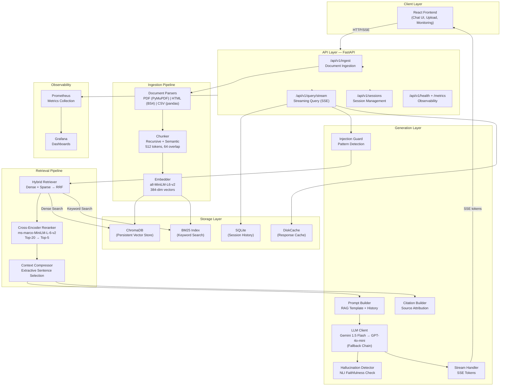

# RAG Assistant — Architecture

## System Overview

The RAG Assistant is a production-grade Retrieval-Augmented Generation system designed to ingest 10,000+ documents in mixed formats (PDF, HTML, CSV) and answer natural-language questions with grounded, cited responses.

## Architecture Diagram



## Component Details

### 1. Ingestion Pipeline

| Stage | Technology | Details |
|-------|-----------|---------|
| PDF Parsing | PyMuPDF (fitz) | Page-by-page extraction, preserves page numbers |
| HTML Parsing | BeautifulSoup4 | Strips scripts/styles, preserves heading hierarchy |
| CSV Parsing | pandas | Row-to-text conversion with sliding window |
| Chunking | Recursive + Semantic | 512-token chunks, 64-token overlap |
| Embedding | sentence-transformers | all-MiniLM-L6-v2, 384-dim, ~14k tokens/sec |

**Chunking Justification:**
- **512 tokens** balances retrieval precision and context richness. Smaller chunks improve recall but lose context; larger chunks hurt precision.
- **64-token overlap** ensures no concept is split across chunk boundaries.
- **Recursive splitting** on `["\n\n", "\n", ". ", " "]` respects natural text boundaries.
- **Semantic splitting** for long narrative documents groups related sentences.

### 2. Retrieval Pipeline

**Hybrid Retrieval (Dense + Sparse):**
- **Dense**: ChromaDB cosine similarity search on 384-dim embeddings — captures semantic meaning
- **Sparse**: BM25 keyword matching — captures exact term matches
- **Fusion**: Reciprocal Rank Fusion (RRF) with `k=60` combines both ranked lists without needing score calibration

**Reranking:**
- Cross-encoder `ms-marco-MiniLM-L-6-v2` provides accurate relevance scoring
- Reduces top-20 retrieved chunks to top-5 for generation
- ~3-5x precision improvement over bi-encoder alone

**Context Compression:**
- Extracts only relevant sentences from each chunk using TF-IDF overlap
- Reduces prompt length by ~40-60% without losing key information

### 3. Generation Layer

**LLM Fallback Chain:**
```
gemini-1.5-flash → gemini-1.0-pro → gpt-4o-mini → gpt-3.5-turbo
```

**Streaming:**
- FastAPI `StreamingResponse` with Server-Sent Events (SSE)
- Tokens streamed token-by-token for low perceived latency
- Final metadata event includes citations, hallucination score, model used

**Session Memory:**
- Last 10 turns stored in SQLite
- Prepended to prompt as conversation history
- Enables follow-up questions and context continuity

### 4. Security

| Threat | Mitigation |
|--------|-----------|
| Prompt Injection | Pattern-based regex guard + system prompt hardening |
| Data Extraction | System prompt instructs model to only use provided context |
| Rate Abuse | slowapi 60 req/min per IP |
| Input Validation | Pydantic models, max 2000 chars query |
| Hallucination | NLI faithfulness scoring with disclaimer flagging |

### 5. Observability

- **Prometheus metrics**: latency histograms, token counts, cache hit rate, model usage
- **Grafana dashboards**: pre-configured with RAG-specific panels
- **Structured JSON logging**: with correlation IDs and request tracing
- **Health endpoint**: component-level health checks

## Data Flow

```
User Query
    ↓
[Injection Guard] ← blocked if malicious
    ↓
[Session History] ← load last 10 turns
    ↓
[Hybrid Retrieval] → Dense (ChromaDB) + Sparse (BM25)
    ↓
[RRF Fusion] → Top-20 combined results
    ↓
[Cross-Encoder Reranker] → Top-5 best results
    ↓
[Context Compressor] → Extract relevant sentences
    ↓
[Prompt Builder] → System + History + Context + Query
    ↓
[LLM Generation] → Streaming tokens → SSE to frontend
    ↓
[Hallucination Detector] → Check faithfulness
    ↓
[Citation Builder] → Build source references
    ↓
[Session Save] → Store Q&A in SQLite
    ↓
[Metrics Update] → Prometheus counters/histograms
```

## Scalability Considerations

- **Horizontal scaling**: Backend is stateless (shared ChromaDB volume); multiple instances possible
- **Vector DB**: ChromaDB can be replaced with Qdrant/Weaviate for distributed deployment
- **Embedding**: Can offload to a separate embedding service (e.g., Triton Inference Server)
- **LLM**: Multiple API keys with round-robin for higher throughput
- **Caching**: DiskCache → Redis for multi-node deployments
